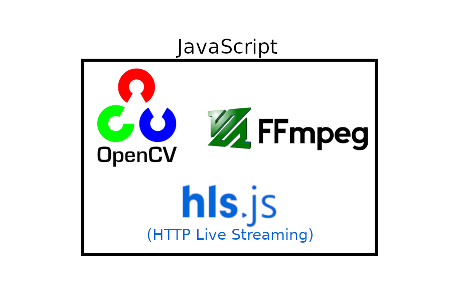

> [Deprecated] Javascript bindings are a little unstable. New version here: [https://github.com/erceth/OPENCV-FFMPEG-HLS-VMS-JS-PY-public](https://github.com/erceth/OPENCV-FFMPEG-HLS-VMS-JS-PY-public)
# OpenCV FFmpeg HLS Video Management System


## Combines OpenCV, FFmpeg and HLS using Javascript

1. Streams RTSP video from cameras using FFmpeg
1. Sends images from stream to OpenCV to do pedestrian detection
1. Superimposed detection areas in stream HLS stream
1. Saves HLS streams for historical playback


## Live Stream
System accepts RTSP streams from an IP cameras as input for FFMPEG. FFMPEG outputs a HLS manifest file for each stream and saves transport files in chronological folder structure.

On the browser, HLS.js downloads the manifest files, retrieves the transport files and streams the live video.

## Historical Playback
FFMPEG stores transport files (.ts) in chronological folder structure. Files older than a configured time are automatically deleted from the manifest file and folder structure. The browser displays all old footage available and can request old transport files to display past footage.

## Pedestrian Detection
While FFMPEG is live streaming, images are extracted from the stream to perform pedestrian detection using OpenCV. The rate that images are extracted can be configured. Usually it is something like 2 frames per second. The result of the image processing is saved as a mostly transparent PNG with boxes containing the regions of interest. The PNG is superimposed on the output stream that is saved in the transport file. One advantage of this approach is live streams can run at its normal 30 frames per second while the superimposed image processing only has to update 2 frames per second.

## Video Explanation
[YouTube](https://youtu.be/QGhwtXW9Zas)

## Dependencies

built using:
ffmpeg v4.2.2,
node v15.5.0,
npm v6.14.11,
openCV v4.3.0

*see other documentation for installing these dependencies*

Noteworthy Node Modules:
@erceth/pedestrian-detection,
@erceth/non-maximum-suppression,
opencv4nodejs


## Getting Started
Required configuration required in package.json
>  Tells opencv4nodejs to only install listed openCV modules and what version of openCV to install.
```
"opencv4nodejs": {
  "autoBuildFlags": "-DBUILD_LIST=core,highgui,imgcodecs,objdetect,video,videoio",
  "autoBuildOpencvVersion": "4.3.0"
},
```

Then:
```
npm install
```

Copy config-server.js.template to config-server.js and config-app.js.template to config-app.js

Explanation:
config-server.js
```
module.exports = {
  general: {
    segmentTime: 4, // length of transport files. Could be set to 60 for minute long historical playback list
    listSize: 1440 // number of transport files saved before oldest gets deleted. Multiple by segmentTime to get age.
  },
  cameras: [
    {
      // input: 'ped3-480.mp4', // causes FFMPEG to stream from a local video file. Good for debugging
      ip: '192.168.1.88', // ip address of ip camera
      path: '/axis-media/media.amp?resolution=640x480', 
      detectParameters: { // parameters passed to pedestrian-detection. The are explained in detail in @erceth/pedestrian-detection 
        width: 400,
        hitThreshold: 1, 
        windowStride: 6,
        padding: 2,
        scale: 1.04,
        fps: 3
      }
    },
    {
      // input: 'ped3-480.mp4',
      ip: 'admin:Qn4KZqt8@192.168.1.43:554',
      path: '/cam/realmonitor?channel=1&subtype=01&authbasic=ZSYybE07Mm9uq2o2XLU=',
      detectParameters: {
        width: 400,
        hitThreshold: 1,
        windowStride: 1,
        padding: 6,
        scale: 1.04,
        fps: 3
      }
    }
  ]
}
// MUST MATCH config-app.js
```

config-app.js
Tells front-end how many streams to expect. Must match config-server.js
```
const config = {
  cameras: [
    {
      index: 0
    },
    {
      index: 1
    }
  ]
};
```

### Run
```
node index.js
```

Open: http://localhost:3000/


